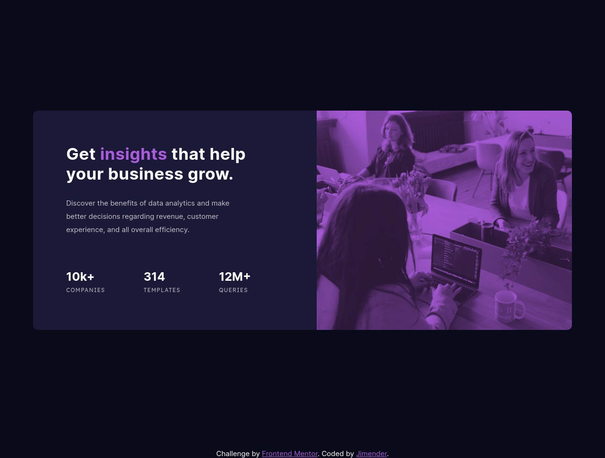

# Frontend Mentor - Stats preview card component solution

This is a solution to the [Stats preview card component challenge on Frontend Mentor](https://www.frontendmentor.io/challenges/stats-preview-card-component-8JqbgoU62). Frontend Mentor challenges help you improve your coding skills by building realistic projects.

## Table of contents

- [Overview](#overview)
  - [The challenge](#the-challenge)
  - [Screenshot](#screenshot)
  - [Links](#links)
- [My process](#my-process)
  - [Built with](#built-with)
  - [What I learned](#what-i-learned)
  - [Continued development](#continued-development)
  - [Useful resources](#useful-resources)
- [Author](#author)
- [Acknowledgments](#acknowledgments)

## Overview

### The challenge

Users should be able to:

- View the optimal layout depending on their device's screen size

### Screenshot

### Links

- Solution URL: [FrontEnd Mentor](https://www.frontendmentor.io/solutions/stats-preview-Q5623RsOgE)
- Live Site URL: [Stats-Preview](https://jimender.github.io/Stats-Preview/)

## My process

### Built with

- Semantic HTML5 markup
- Sass
- Flexbox

Fixed some minor media query bugs

### What I learned

- Learned how to use basic level of `Flexbox` & `MediaQueries`.
- Learned about `background-blend-mode` & `mix-blend-mode`

### Continued development

Want to exlpore more about flexbox for better & optimal use cases.

### Useful resources

- [Flexbox](https://css-tricks.com/snippets/css/a-guide-to-flexbox/)
- [mix-blend-mode](https://css-tricks.com/almanac/properties/m/mix-blend-mode/)

## Author

- Frontend Mentor - [@Jimender](https://www.frontendmentor.io/profile/Jimender)

## Acknowledgments

Thanks to [airdgo](https://github.com/airdgo/stats-preview) , [MRZ.Code.Manufacture](https://www.youtube.com/watch?v=zaHdmJf_ld4) for helping in flexbox & color matching.
